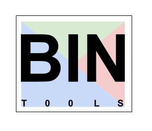

# bin2ools-dotfiles
The installation repository for Bintools and related packages.  




# PREPARING TO INSTALL BINTOOLS

Please watch this short video and follow the steps outlined to clean up your laptop and prepare 
to install Homebrew, and other installation tools.  If you do not perform this step manually, 
it can be very difficult to predict whether the install will properly succeed. If anything unusual
shows up during this step, feel free to ask questions in the DevOps Slack channel, or in the 
Bintools-rollout channel. They will be answered quickly! 

https://www.loom.com/share/8b0fee43baf24488a6a114aac075be11

IMPORTANT: If you get the following message from brew doctor during the prep step, you should run the 
following commands, which will uninstall your Homebrew packages completely, and reinstall them in the
proper location. NOTE: This is **absolutely necessary** for your system to operate properly, moving forward. 


## Installation

[]()  **Warning:** See above if you have never given bintools-dotfiles a try.  You should first review the short video subject above, which will walk you through important PREP STEPS before installing Homebrew and pipx packages that constitute a Bin2ools install on your MacBook. NOTE: Bintools scripts and settings are included in newer laptops to make your life easier, but don't use them blindly, especially if you have strong opinions about open source.  They are still "Use at your own risk!"

### Using this Github repository, and the automatic installer. 

The script below clones the repository under ~/.bintools-dotfiles in your home directory. It's important to keep this location, as other tools and scripts may look to find it there.  The bootstrapper script will clone (or pull) the latest version and copy the files to this directory.  The installer usually takes 10-15 minutes, and installs all components hands-free.  If you have no Git credential helper installed, it will install one on your behalf, asking once or twice for your Github credentials using a pop up browser page. It also asks for your root password exactly once, and will produce an Okta credential popup upon completion, so you can perform your first login.  

If the installer has trouble for any reason, you can safely rerun it multiple times.  It is idempotent.  Just cut and paste one of the commands below.  The first commmand installs ONLY the basic rds and ssm tools and the zero-trust login framework.  The second link installs Database graphic tools, such as MySQL Bench and DataGrip in addition to the basic tools. Other tools are also available for install. The list is steadily growing!  See the addenda notes for a list of packages near the end of this doc for other notable features that can be added to your bintools!

```bash
u=https://bit.ly/3Kavmy1 f=${HOME}/i.sh && (curl -L $u||wget -O - $u||fetch -o - $u) > $f && chmod 700 $f && $f
```

```bash
<Temporarily unavailable.>
```

To update, `cd` into your local `dotfiles` repository and then:

```bash
source bootstrap.sh
```

Alternatively, to update while avoiding the confirmation prompt:

```bash
set -- -f; source bootstrap.sh
```

### Git-free install

To install these dotfiles without Git (e.g. on a Linux-based deployment container:

```bash
cd; curl -#L https://github.com/mathiasbynens/dotfiles/tarball/main | tar -xzv --strip-components 1 --exclude={README.md,bootstrap.sh,.osx,LICENSE-MIT.txt}
```

To update later on, just run that command again.

### Specify the `$PATH`

If `~/.path` exists, it will be sourced along with the other files, before any feature testing (such as [detecting which version of `ls` is being used](https://github.com/mathiasbynens/dotfiles/blob/aff769fd75225d8f2e481185a71d5e05b76002dc/.aliases#L21-L26)) takes place.

Here’s an example `~/.path` file that adds `/usr/local/bin` to the `$PATH`:

```bash
export PATH="/usr/local/bin:$PATH"
```

### Add custom commands without creating a new fork

If `~/.extra` exists, it will be sourced along with the other files. You can use this to add a few custom commands without the need to fork this entire repository, or to add commands you don’t want to commit to a public repository.

My `~/.extra` looks something like this:

```bash
# Git credentials
# Not in the repository, to prevent people from accidentally committing under my name
GIT_AUTHOR_NAME="Mathias Bynens"
GIT_COMMITTER_NAME="$GIT_AUTHOR_NAME"
git config --global user.name "$GIT_AUTHOR_NAME"
GIT_AUTHOR_EMAIL="mathias@mailinator.com"
GIT_COMMITTER_EMAIL="$GIT_AUTHOR_EMAIL"
git config --global user.email "$GIT_AUTHOR_EMAIL"
```

You could also use `~/.extra` to override settings, functions and aliases from my dotfiles repository. It’s probably better to [fork this repository](https://github.com/mathiasbynens/dotfiles/fork) instead, though.

### Sensible macOS defaults

When setting up a new Mac, you may want to set some sensible macOS defaults:

```bash
./.macos
```

### Install Homebrew formulae

When setting up a new Mac, you may want to install some common [Homebrew](https://brew.sh/) formulae (after installing Homebrew, of course):

```bash
./brew.sh
```

Some of the functionality of these dotfiles depends on formulae installed by `brew.sh`. If you don’t plan to run `brew.sh`, you should look carefully through the script and manually install any particularly important ones. A good example is Bash/Git completion: the dotfiles use a special version from Homebrew.

## Feedback

Suggestions/improvements
[welcome](https://github.com/mathiasbynens/dotfiles/issues)!

## Author

| [](http://twitter.com/mathias "Follow @mathias on Twitter") |
|---|
| [Mathias Bynens](https://mathiasbynens.be/) |

## Thanks to…

* @ptb and [his _macOS Setup_ repository](https://github.com/ptb/mac-setup)
* [Ben Alman](http://benalman.com/) and his [dotfiles repository](https://github.com/cowboy/dotfiles)
* [Cătălin Mariș](https://github.com/alrra) and his [dotfiles repository](https://github.com/alrra/dotfiles)
* [Gianni Chiappetta](https://butt.zone/) for sharing his [amazing collection of dotfiles](https://github.com/gf3/dotfiles)
* [Jan Moesen](http://jan.moesen.nu/) and his [ancient `.bash_profile`](https://gist.github.com/1156154) + [shiny _tilde_ repository](https://github.com/janmoesen/tilde)
* Lauri ‘Lri’ Ranta for sharing [loads of hidden preferences](https://web.archive.org/web/20161104144204/http://osxnotes.net/defaults.html)
* [Matijs Brinkhuis](https://matijs.brinkhu.is/) and his [dotfiles repository](https://github.com/matijs/dotfiles)
* [Nicolas Gallagher](http://nicolasgallagher.com/) and his [dotfiles repository](https://github.com/necolas/dotfiles)
* [Sindre Sorhus](https://sindresorhus.com/)
* [Tom Ryder](https://sanctum.geek.nz/) and his [dotfiles repository](https://sanctum.geek.nz/cgit/dotfiles.git/about)
* [Kevin Suttle](http://kevinsuttle.com/) and his [dotfiles repository](https://github.com/kevinSuttle/dotfiles) and [macOS-Defaults project](https://github.com/kevinSuttle/macOS-Defaults), which aims to provide better documentation for [`~/.macos`](https://mths.be/macos)
* [Haralan Dobrev](https://hkdobrev.com/)
* Anyone who [contributed a patch](https://github.com/mathiasbynens/dotfiles/contributors) or [made a helpful suggestion](https://github.com/mathiasbynens/dotfiles/issues)
